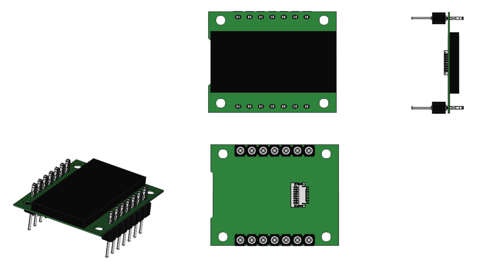
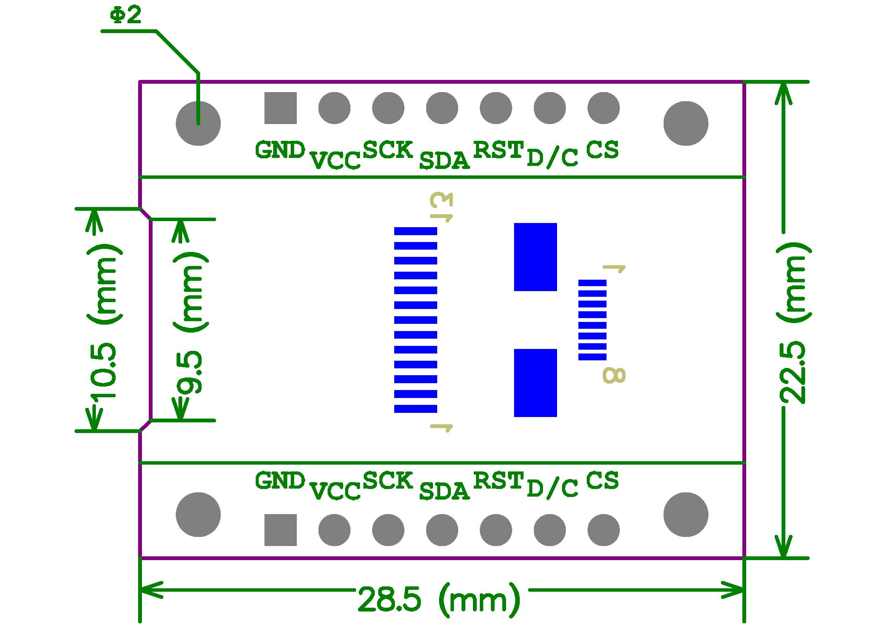
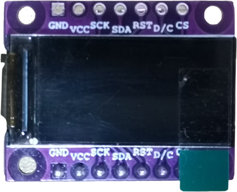
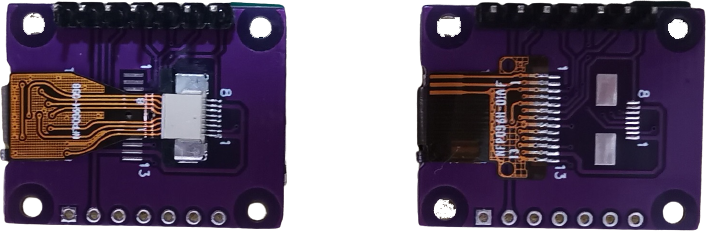

## Module introduction

0.96inch TFT screen 80 * 160 RGB；

3.3V power supply；

default background light；

4-line SPI control；

size：56mm * 34mm

shopping link：https://item.taobao.com/item.htm?ft=t&id=696823034902

video link：https://www.bilibili.com/video/BV11P4y1q7pL

### PCB 3D



### Assembly Size Diagram



### Physical Map






### Footprint Definition

| 引脚          | 描述                                       |
| ------------- | ------------------------------------------ |
| 1. GND        | Ground                                     |
| 2. VCC        | 3.3V power supply                          |
| 3. SCK        | SPI_SCK                                    |
| 4. SDA        | SPI_MOSI                                   |
| 5. RST        | reset                                      |
| 6. A0（D/CX） | data/command (connect to ST7735s D/CX pin) |
| 7. CS         | SPI_NSS                                    |


## Reference

| folder           | description                     |
| ---------------- | ------------------------------- |
| code             | driver demo by multi MCUs       |
| picture          | PCB 3D, Physical Map            |
| datasheet        | ST7735 datasheet                |
| assembly diagram | hardware size、3D model (.step) |


## Hardware Connection

### Software SPI

Any 5 IOs connect to the TFT module.


### Hardware SPI

Select pins connected to MCU's inner hardware SPI. 


## Software

Step1: add lcd_st7735s.c、lcd_st7735s.h、font.h、hz_16x16.h（Chinese font）、hz_32x32.h（Chinese font) to your project.

Step2: simply revise the definition to adapt your MCU.


Example 1：MCU=GD32F103C8T6。

**PIN connection**

PB11 <---------> SCK

PB12 <---------> SDA

PB13 <---------> RST

PB14 <---------> A0

PB15 <---------> CS


**Definition：**

```c
#define LCD_RCU RCU_GPIOB
#define LCD_PORT GPIOB
#define LCD_PIN_SCK GPIO_PIN_11
#define LCD_PIN_SDA GPIO_PIN_12
#define LCD_PIN_RES GPIO_PIN_13
#define LCD_PIN_A0 GPIO_PIN_14
#define LCD_PIN_CS GPIO_PIN_15

#define SET_LCD_CS 	gpio_bit_set(LCD_PORT, LCD_PIN_CS)
#define SET_LCD_RES gpio_bit_set(LCD_PORT, LCD_PIN_RES)
#define SET_LCD_A0 	gpio_bit_set(LCD_PORT, LCD_PIN_A0)
#define SET_LCD_SDA gpio_bit_set(LCD_PORT, LCD_PIN_SDA)
#define SET_LCD_SCK gpio_bit_set(LCD_PORT, LCD_PIN_SCK)

#define	CLR_LCD_CS  gpio_bit_reset(LCD_PORT, LCD_PIN_CS)
#define	CLR_LCD_RES  gpio_bit_reset(LCD_PORT, LCD_PIN_RES)
#define	CLR_LCD_A0  gpio_bit_reset(LCD_PORT, LCD_PIN_A0)
#define	CLR_LCD_SDA  gpio_bit_reset(LCD_PORT, LCD_PIN_SDA)
#define	CLR_LCD_SCK  gpio_bit_reset(LCD_PORT, LCD_PIN_SCK)
```


Example 2：MCU=STM32F103VCT6

**PIN connection**

PE9   <---------> SCK

PE12 <---------> SDA

PE8   <---------> RST

PE10 <---------> A0

PE11 <---------> CS


**Definition：**

```c
#define LCD_PORT GPIOE
#define LCD_PIN_CS GPIO_Pin_11
#define LCD_PIN_RES GPIO_Pin_8
#define LCD_PIN_A0 GPIO_Pin_10
#define LCD_PIN_SDA GPIO_Pin_12
#define LCD_PIN_SCL GPIO_Pin_9

#define SET_LCD_CS 	GPIO_SetBits(LCD_PORT, LCD_PIN_CS)
#define SET_LCD_RES GPIO_SetBits(LCD_PORT, LCD_PIN_RES)
#define SET_LCD_A0 	GPIO_SetBits(LCD_PORT, LCD_PIN_A0)
#define SET_LCD_SDA GPIO_SetBits(LCD_PORT, LCD_PIN_SDA)
#define SET_LCD_SCL GPIO_SetBits(LCD_PORT, LCD_PIN_SCL)

#define	CLR_LCD_CS  GPIO_ResetBits(LCD_PORT, LCD_PIN_CS)
#define	CLR_LCD_RES  GPIO_ResetBits(LCD_PORT, LCD_PIN_RES)
#define	CLR_LCD_A0  GPIO_ResetBits(LCD_PORT, LCD_PIN_A0)
#define	CLR_LCD_SDA  GPIO_ResetBits(LCD_PORT, LCD_PIN_SDA)
#define	CLR_LCD_SCL  GPIO_ResetBits(LCD_PORT, LCD_PIN_SCL)
```


## DEMO Explanation

/code : with multi MCU driver  source code and head file

/code/font : with font source file and head file


**Supported MCU:**

GD32F103

STM32F103/STM32L151/STM32F030/STM32F303/STM32F407/STM32L476


